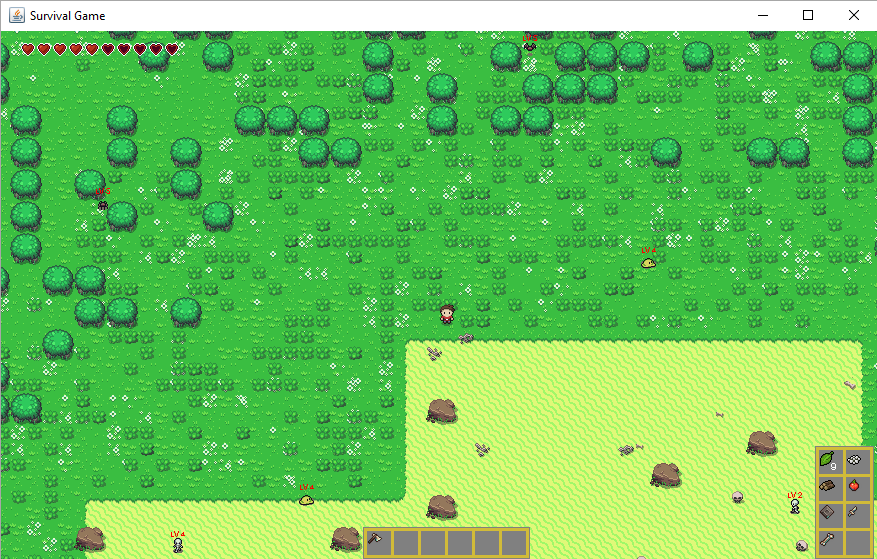

# SurvivalGame

2D RPG game written in Java

## Basic Info

The game requires Java 1.8 or higher. It consists of 2D RPG open world with randomly generated world, monsters,
crafting and much more. It also contains some basic modding API, so you can extend some of game functionality.

## Key Binding

W, A, S, D - move around
I - open/close backpack inventory
C - open/close list of crafting recipes
B - debug info
P - pause game
L - load plugins
U - unload plugins
R - reload plugins

## License

This project is licensed under the MIT License - see the [LICENSE.md](LICENSE.md) file for details

